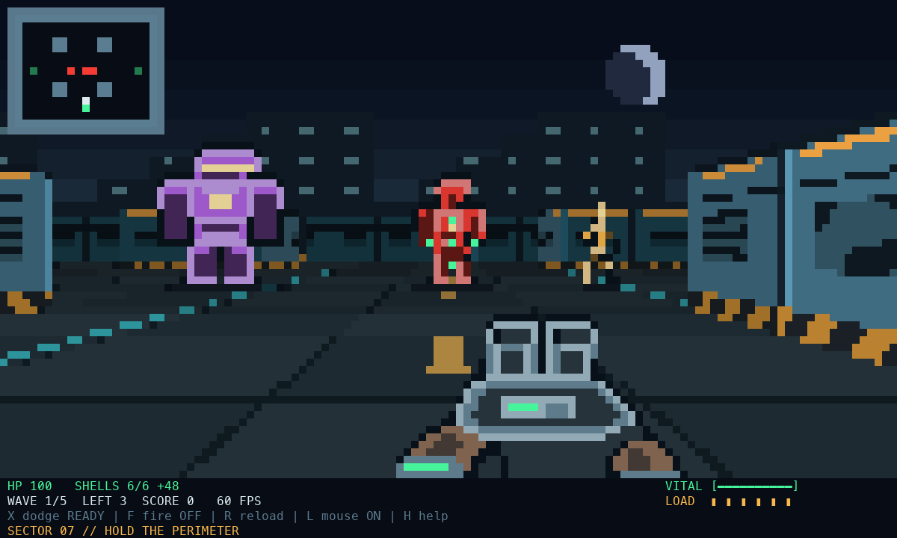

# TERMINAL // BREACH — Rust edition

A five-wave arena FPS played in a terminal. The game, renderer, input handling,
and terminal lifecycle are implemented in Rust. The executable has no Python
runtime dependency.

The arena has an industrial night setting: illuminated steel panels, hazard
stripes, floor guide lights, a distant skyline, and a crescent moon. Armored enemy
silhouettes, contact shadows, a shaded shotgun, and health/ammo indicators keep
combat readable. Small terminals use a compact local minimap.



*Renderer preview at 120×36 cells; terminal fonts and colors can differ.*

## Play

This checkout has a project-local Rust toolchain installed:

```bash
./play.sh
```

The launcher builds the optimized executable and starts it. On another machine,
install [Rust](https://rustup.rs/) first, then use the launcher or Cargo:

```bash
cargo run --release --locked
```

After building, run `./target/release/terminalshooter` directly if you prefer.
On Windows, use `cargo run --release --locked` or
`target\release\terminalshooter.exe`. macOS is tested locally. Linux and Windows
are supported by the terminal library but have not been verified on this machine.

## First run

Press **Enter** to deploy. Use **WASD** to move, **Q/E** to turn, **F** to toggle
continuous fire, and **X** to dodge. Keyboard-only play is supported. Close the
distance for more shotgun damage and use the pillars to separate enemies.

- Red grunts are steady pursuers. Gold runners are fast. Purple brutes are tough.
- Cyan enemies are spawning and harmless. Yellow enemies are winding up an attack.
- Shoot to interrupt an attack, move out of reach, or dodge. Dodge follows your
  movement direction, or forward when stationary, and has a 1.8-second cooldown.
- The shotgun hits enemies across its spread. A centered close shot kills a grunt.
- Quick kills build a score multiplier up to 5x. Taking damage breaks the streak.
- Between waves, a four-second break restores 25 HP and resupplies shells.
- Green pickups heal; amber pickups provide ammo. Two medkits start in the side lanes.
- Clear all five waves to win. The HUD points toward the last two enemies.

## Controls

| Input | Action |
|---|---|
| W / Up, S / Down | Forward, backward |
| A / D | Strafe |
| Q / E, Left / Right | Turn |
| Shift+W | Sprint |
| Space / left mouse | Shoot on press; hold left mouse for continuous fire and automatic reload |
| F | Toggle continuous fire |
| R / right mouse | Reload |
| X | Dodge in your movement direction |
| Mouse movement | Horizontal aim, when the terminal reports motion |
| L | Toggle terminal mouse-look; reset its movement baseline |
| `[` / `]` / mouse wheel | Adjust sensitivity |
| M / Shift+M | Minimap / tactical map |
| H | Field manual |
| P / Escape | Pause/resume; close an overlay |
| B | Toggle terminal beeps |
| R / Enter after a run | Restart, preserving control preferences |
| Ctrl-C | Quit from any screen |

The title screen, menus, and tactical map freeze simulation. Focus loss pauses
the game and clears held input and automatic firing. The minimap's green dot
marks the player's containing cell; its white tick shows the facing direction.

## Terminal input limitations

The Rust version uses [Crossterm](https://docs.rs/crossterm/0.29.0/crossterm/event/index.html)
for key, mouse, focus, and resize events. It does **not** attempt desktop pointer
locking. The experimental pointer-lock helper has also been removed from Python.
Mouse movement stops at window edges; Q/E can always rotate the camera. `L` toggles
mouse-look, not pointer capture.

Compatible terminals use key press/release events through the keyboard enhancement
protocol. In local macOS sessions, movement keys received by the game can also use
[Quartz key-state checks](https://developer.apple.com/documentation/coregraphics/cgeventsource/keystate(_:key:))
to keep moving while held and stop on release, including simultaneous WASD keys.
This checks only received game controls and installs no keyboard event tap. Native
tracking starts only after a physical press is confirmed; SSH and terminal
multiplexers use terminal input. The physical mapping uses standard Mac WASD key
positions; other layouts retain terminal input when the physical key does not match.

When neither release events nor native state are available, an isolated tap lasts
at most 45 ms (about 0.17 map cells or 6 degrees). Repeating input uses a 100 ms
timeout. The fallback does not assume a hold during the OS's initial repeat delay,
so movement can pause before repeats begin. Native state or key-release support
is needed for both precise taps and uninterrupted holds. `F` avoids relying on
key repeat for shooting.

## Performance and options

```bash
./play.sh --256                  # reduced terminal output
./play.sh --truecolor            # richer color
./play.sh --fps 30               # lower display update rate
./play.sh --large                # viewport up to 220x70
./play.sh --no-mouse             # keyboard-only aiming
./play.sh --seed 7               # reproducible spawns
./play.sh --bench                # headless render/encoding benchmark
./play.sh --help
```

Default: 60 display frames per second, with a viewport capped at 120x36 cells.
Minimum terminal size: 40x16. Shrinking below that size suspends gameplay.
The simulation advances in fixed 120-Hz steps independently of rendering FPS,
with a bounded catch-up interval after stalls.
Frame deadlines compensate for late OS wakeups instead of accumulating sleep
delay. Mouse presses fire immediately; quick Space taps survive until the next
simulation step.

The renderer compares final, encoded cells and sends only changes. Text, menus,
and graphics are composed before output; synchronized updates are used where the
terminal supports them. Static menus send nothing after the first frame.
256-color comparisons happen after palette conversion, avoiding redundant colors.
The terminal still determines visible FPS: `--bench` excludes terminal drawing,
output latency, and human playtesting.

## Development and checks

With Rust on PATH:

```bash
cargo fmt --check
cargo clippy --all-targets --locked -- -D warnings
cargo test --locked
cargo build --release --locked
cargo run --release --locked -- --bench --256
```

For the isolated toolchain installed in this checkout, run this once in your shell:

```bash
export RUSTUP_HOME="$PWD/.tools/rustup"
export CARGO_HOME="$PWD/.tools/cargo"
export PATH="$CARGO_HOME/bin:$PATH"
```

Tests cover complete runs, collision/navigation, shotgun spread, dodging, ammo,
pause/restart, keyboard release/fallback, `L`, minimap coordinates, menu composition,
and incremental output. Unix tests launch the real executable through a
pseudo-terminal to exercise protocol negotiation, input, resizing, focus loss,
Ctrl-C, SIGTERM, and mode restoration. They do not drive the desktop Terminal GUI
or physically move the pointer.

| File | Responsibility |
|---|---|
| `src/world.rs` | Map, collision, DDA rays, pathfinding, seeded randomness |
| `src/game.rs` | Player, enemies, combat, pickups, waves, game states |
| `src/input.rs` | Terminal events, key holds, mouse input, control actions |
| `src/keyboard.rs` | Local macOS state checks for received movement controls |
| `src/render.rs` | Pixel/text composition, projection, sprites, HUD, ANSI differences |
| `src/art.rs` | Authored enemy and weapon pixel silhouettes |
| `src/main.rs` | CLI, terminal lifecycle, signal cleanup, fixed-step loop, benchmark |
| `src/pacing.rs` | Frame deadlines and recovery after output stalls |
| `tests/` | Gameplay, input/rendering, and executable PTY checks |

The existing `fps_hd.py` and `test_fps.py` remain available
as the previous Python version. They are not used by the Rust game. Its historical
documentation is in [docs/PYTHON_VERSION.md](docs/PYTHON_VERSION.md).
